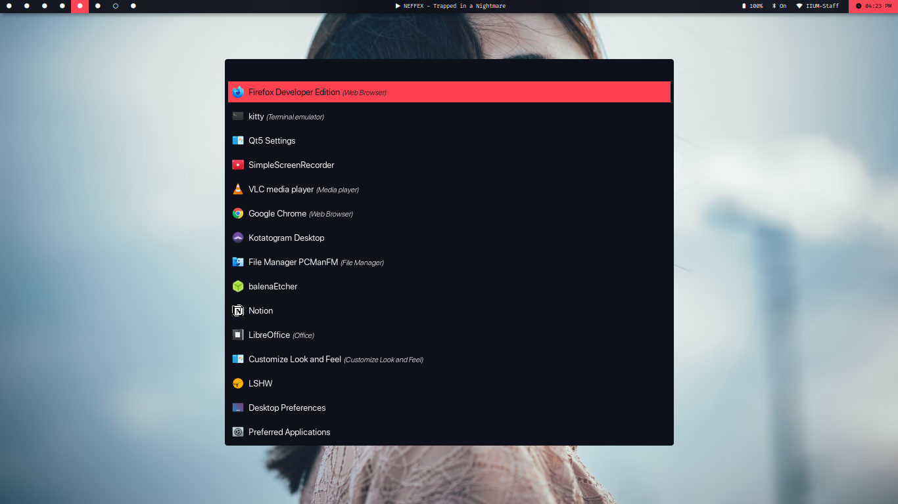

### Installation:

- Clone or download this repo
- copy config `cp config.rasi ~/.config/rofi`
- copy theme file `cp material-ocean.rasi ~/.config/rofi`
- enjoy!

### License:

Licensed under [GNU’s GPL version 3](https://github.com/material-ocean/Material-Ocean/blob/master/LICENSE)

